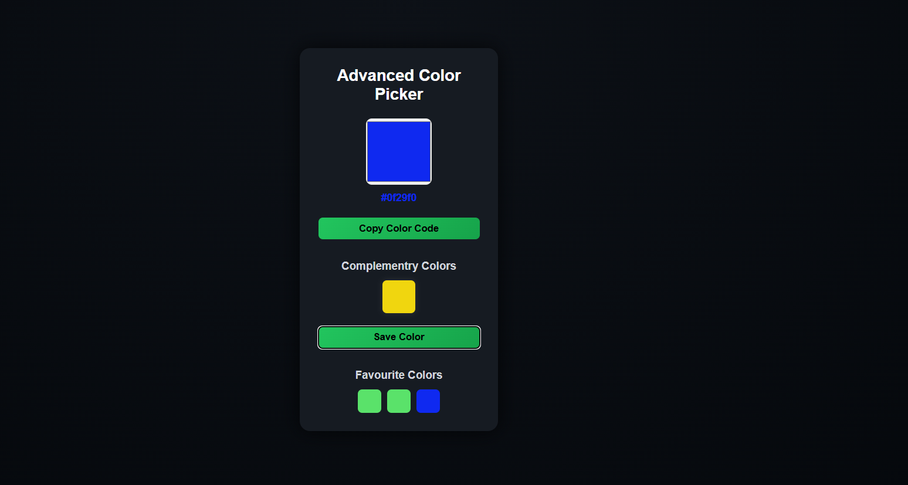

# 🎨 Advanced Color Picker

An interactive and visually appealing color picker built using HTML, CSS, and JavaScript.  
This project allows users to select colors, view their complementary shades, and save favorite colors with a smooth and modern user interface.

## 🚀 Features

- 🎯 Pick any color using the color input  
- 🎨 Automatically generates complementary colors  
- 📋 Copy color code to clipboard with one click  
- ⭐ Save favorite colors for quick access  
- 🔁 Click saved colors to reuse them instantly  
- ✨ Smooth hover effects and modern UI design  

## 🛠️ Tech Stack

- HTML  
- CSS (Flexbox, Gradients, UI Effects)  
- JavaScript (DOM Manipulation, Events)  

## 📸 Preview

## 📌 How It Works

1. Select a color using the color picker  
2. The selected color code is displayed instantly  
3. Complementary colors are generated automatically  
4. Click **Copy Color Code** to copy the hex value  
5. Save your favorite colors and reuse them anytime  

---

A beginner-to-intermediate level project demonstrating JavaScript concepts like DOM manipulation, event handling, and color logic along with modern UI styling.