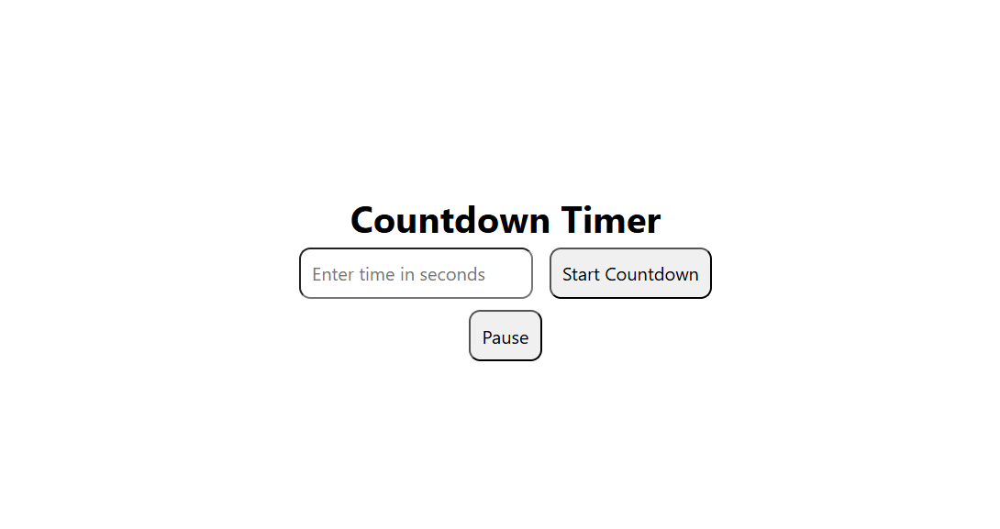

# ⏳ Countdown Timer

An interactive countdown timer built using HTML, CSS, and JavaScript.  
This version includes a smart toggle button that handles both **Pause** and **Resume** functionality, improving user experience and keeping the interface clean.

## 🚀 Features

- Start countdown from user input  
- Single button for **Pause & Resume** (toggle functionality)  
- Real-time countdown display  
- Input validation for valid time values  
- Simple and user-friendly UI  

## 🛠️ Tech Stack

- HTML  
- CSS  
- JavaScript  

## 📸 Preview

## 📌 How It Works

- Enter time in seconds  
- Click **Start Countdown** to begin  
- Use the toggle button to **Pause** and **Resume** the timer  
- Timer updates every second until it reaches zero  

---

A beginner-friendly project demonstrating JavaScript timing functions like `setInterval`, `clearInterval`, and basic state management.