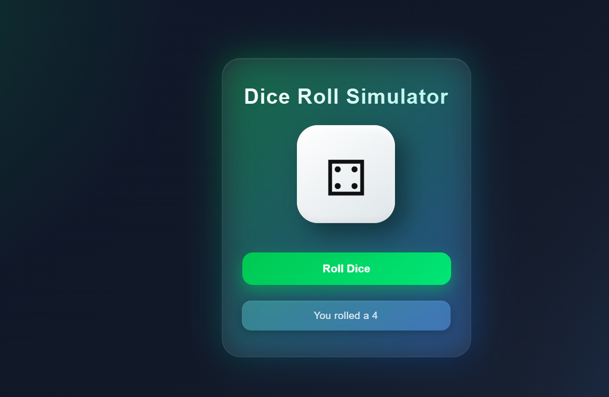

# 🎲 Dice Roll Simulator

A modern and interactive **Dice Roll Simulator** built using **HTML, CSS, and JavaScript**.  
This project simulates rolling a dice with a clean glassmorphism UI, smooth animations, and dynamic dice face generation.

---

## 🚀 Features

- 🎲 Random dice roll generation
- ✨ Animated modern UI
- 🌈 Glassmorphism design
- ⚡ Smooth hover and floating effects
- 📱 Responsive layout
- 🎯 Real-time dice result display

---

## 🖼️ Preview

---

## 🛠️ Tech Stack

- HTML5
- CSS3
- JavaScript (DOM Manipulation)

---

## 🎮 How It Works

1. Click the **Roll Dice** button
2. JavaScript generates a random number from 1–6
3. The dice face updates instantly
4. Result message displays the rolled number

---

## 🔥 Future Improvements

- 🎵 Dice rolling sound effect
- 🎞️ Rolling animation
- 🌙 Dark/Light theme toggle
- 📊 Roll history tracker

---

## 🙌 Author

Made with ❤️ by vinay