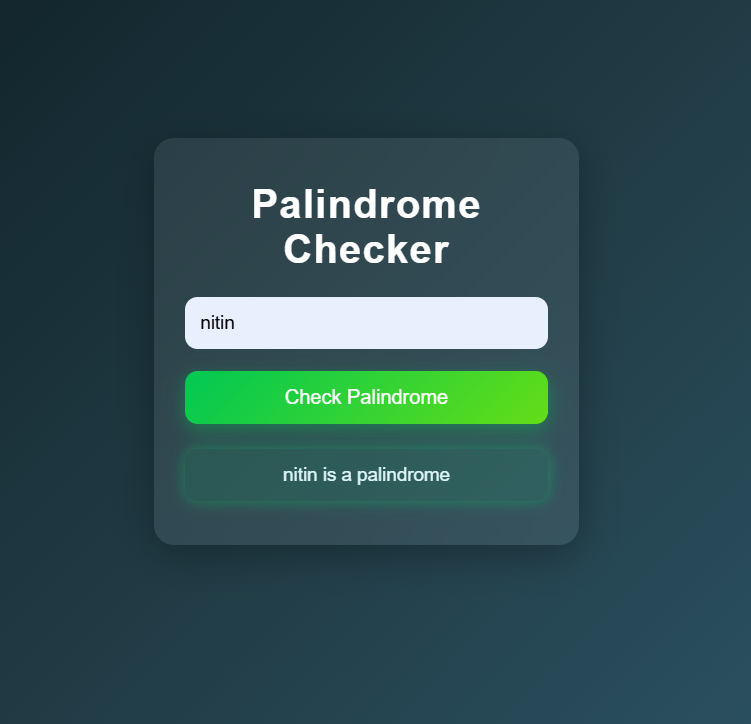

# 🔁 Palindrome Checker

A simple and modern **Palindrome Checker Web App** built using HTML, CSS, and JavaScript.  
It allows users to enter a word or phrase and instantly check whether it is a palindrome.

---

## 🚀 Features

- 🔍 Checks words and phrases (ignores spaces & special characters)
- ⚡ Instant result on button click
- 🎨 Modern UI with glassmorphism design
- ✅ Visual feedback with smooth animations
- 📱 Responsive design

---

## 🖼️ Preview

---

## 🛠️ Tech Stack

- HTML5
- CSS3 (Glass UI + Animations)
- JavaScript (DOM Manipulation)

---
