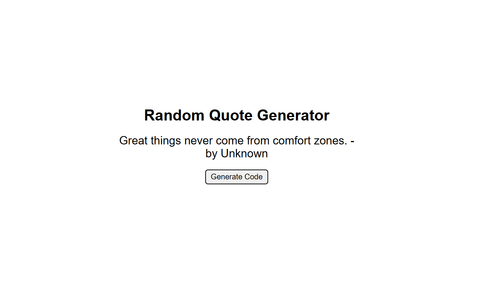

# 📜 Random Quote Generator

A simple and interactive web app that displays a new inspirational quote each time the user clicks a button. The app ensures a clean and minimal user experience.

---

## 🚀 Features

- 🎲 Generate random quotes on button click
- 🔁 No immediate repetition of quotes
- 🧠 Motivational and inspiring quotes
- ⚡ Lightweight and fast
- 💻 Built using HTML, CSS, and JavaScript

---

## 🖼️ Preview

---

## 🛠️ Tech Stack

- HTML
- CSS
- JavaScript

---

## ▶️ How to Use

1. Open the project in your browser
2. Click on the **"Generate Code"** button
3. A new quote will appear instantly

---

## 💡 How It Works

- Quotes are stored in an array
- The array is shuffled to avoid repetition
- Each click shows the next quote
- After all quotes are used, it reshuffles again

---

## 📌 Future Improvements

- 📋 Copy quote button
- ❤️ Save favorite quotes
- 🎨 UI animations
- 🌙 Dark mode
